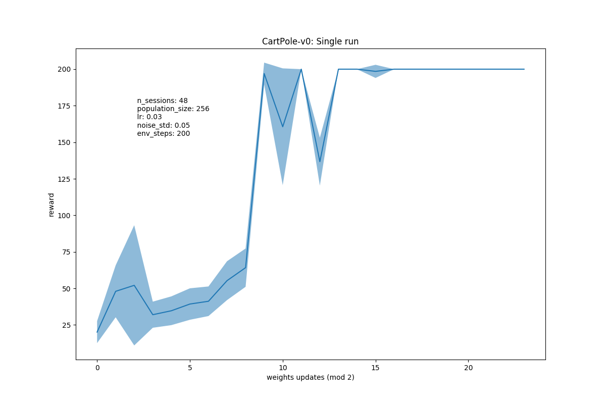
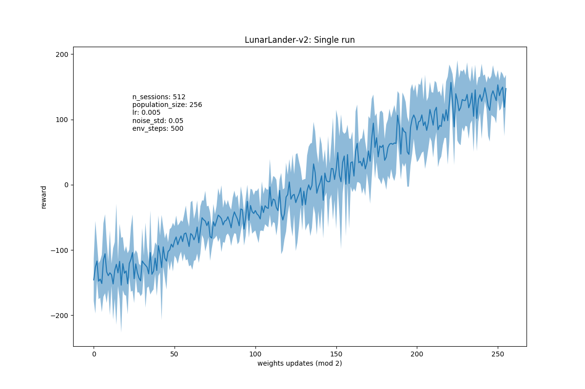

# Evolution Strategies OpenAI

Implementation is strictly for educational purposes, not distributed and not very effitient (yet), but it works.

## Experiments

### CartPole
Easily solves CartPole-V0

### LunarLander
First run on LunarLander 

## TODO

- weight decay (noise std decay???)
- rank transformation 
- mirrored sampling
- parallelization
- env with continuous actions
- env with pixel states (skip frames)

## TODO ENVS

- [x] CartPole   
- [ ] CarRacing      
- [ ] LunarLander    
- [ ] MountainCar (hard)     
- [ ] Taxi & FrozenLake  

# Ideas

- for parallel (exampler interface): es.eval_population(npop) -> updates -> es.update_population(updates)
<!-- функция берет модель, рандомно меняет веса, прогоняет, получает ревард и возвращает апдйет весов сразу -> легче параллелить,
 чем если отдельно генерировать сначала популяцию, потом ее отдельно прогонять, а потом уже апдейтить -->

## References

[Evolution Strategies as a Scalable Alternative to Reinforcement Learning](https://arxiv.org/abs/1703.03864) (Tim Salimans, Jonathan Ho, Xi Chen, Ilya Sutskever)
