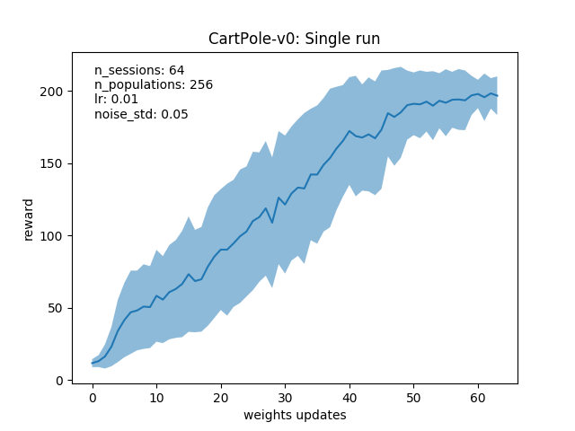
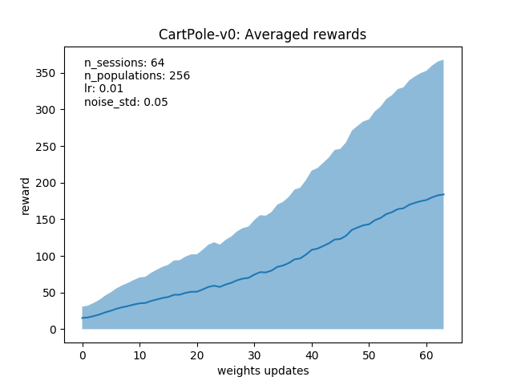

# Evolution Strategies OpenAI

Implementation is strictly for educational purposes, not distributed and not very effitient (yet), but it works.

## Experiments

The std is based on populations, so it's not surprising that it's so large.

# References

[Evolution Strategies as a Scalable Alternative to Reinforcement Learning](https://arxiv.org/abs/1703.03864) (Tim Salimans, Jonathan Ho, Xi Chen, Ilya Sutskever)