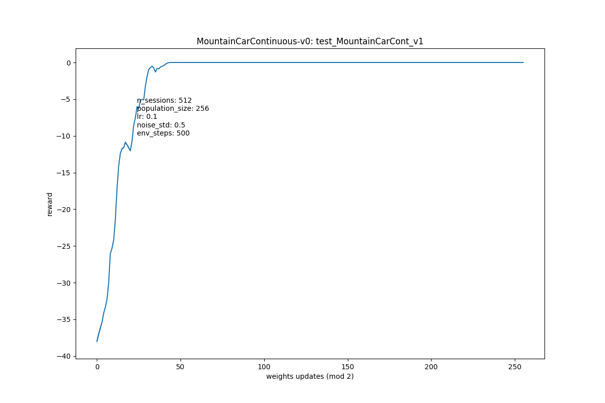

# Evolution Strategies OpenAI

Implementation is strictly for educational purposes and not distributed (as in paper), but it works.

## Experiments

### CartPole

Solved quickly and easily, especially if the population size is increased. However it is necessary to control the learning rate: it is better to put it less, as well as noise std: in this task there is no need to explore, it is enough to get a lot of feedback as a reward for natural gradient estimation. 

<p float="left">
  
   
</p>

### LunarLander

As in the previous task, the algorithm is doing well, it is also important to set a small learning rate, but slightly increase nose std. 

<p float="left">
  
   
</p>

### LunarLanderContinuous

Continuous env is solved much faster and better, probably at the expense of more dense reward. It is also interesting that here the agent has learned to land faster, not to turn on the engines immediately, but only before landing. 

<p float="left">
  
   
</p>

### MountainCarContinuous

Сan't solve it yet.   

In the discrete version of env, the main problem is sparse reward, which is only given at the very end if you climb a hill. Since the agent does not have time for 200 iterations with the random weights to do so, the natural gradient turns out to be zero and the training is stuck. Solution: remove the 200 iteration limit and wait for the random agent to climb the mountain himself, getting the first reward :). However, this is not quite fair.   

In continuous env, the main problem is the lack of exploration. The agent quickly (faster than climbing the hill) realizes that the best way is to stand still and get 0 reward, which is much higher than when moving.

<p float="left">
  
   
</p>

Possible solution: novelity search. As a novelity function it is possible to take velocity, velocity * x_coord, or x_coord at the end of episode. [Reward shaping](https://people.eecs.berkeley.edu/~pabbeel/cs287-fa09/readings/NgHaradaRussell-shaping-ICML1999.pdf) may improve convergence for DQN/CEM methods, but in this case it does not produce better results.

### BipedalWalker

Not solved yet. More iterations is needed.

<p float="left">
  
   
</p>

## Example

```python
from training import run_experiment

example_config = {
    "experiment_name": "test_BipedalWalker_v0",
    "plot_path": "../plots/",
    "model_path": "../models/", # optional
    "log_path": "../logs/" # optional
    "init_model": "../models/test_BipedalWalker_v5.0.pkl",  # optional
    "env": "BipedalWalker-v3",
    "n_sessions": 128,
    "env_steps": 1600, 
    "population_size": 256,
    "learning_rate": 0.06,
    "noise_std": 0.1,
    "noise_decay": 0.99, # optional
    "lr_decay": 1.0, # optional
    "decay_step": 20, # optional
    "eval_step": 10, 
    "hidden_sizes": (40, 40)
  }

policy = run_experiment(example_config, n_jobs=4, verbose=True)
```

## Implemented

- [x] OpenAI ES algorithm [Algorithm 1].
- [x] Z-normalization fitness shaping (not rank-based).
- [x] Parallelization with joblib.
- [x] Training for 6 OpenAI gym envs (3 solved).
- [x] Simple three layer net as policy example.
- [x] [Learning rate & noise std decay.](https://towardsdatascience.com/learning-rate-schedules-and-adaptive-learning-rate-methods-for-deep-learning-2c8f433990d1) 


## TODO

- [ ] [Novelity search.](https://lilianweng.github.io/lil-log/2019/09/05/evolution-strategies.html) 
- [ ] Mirrored sampling.
- [ ] Better gradient steps: Adam.
- [ ] Wrap CarRacing env, add images preprocessing (frame skip, grayscale, downgrade)

## TODO ENVS

- [x] CartPole   
- [x] LunarLander   
- [x] LunarLanderContinuous
- [ ] MountainCarContinuous
- [ ] BipedalWalker-v2
- [ ] CarRacing

<!-- ## Ideas

skip frames - https://notanymike.github.io/Solving-CarRacing/, https://danieltakeshi.github.io/2016/11/25/frame-skipping-and-preprocessing-for-deep-q-networks-on-atari-2600-games/, https://github.com/openai/baselines/blob/master/baselines/common/atari_wrappers.py (NB!, class MaxAndSkipEnv(gym.Wrapper) and class WarpFrame(gym.ObservationWrapper)), https://alexandervandekleut.github.io/gym-wrappers/
noise/lr annealing - https://cs231n.github.io/neural-networks-3/#anneal,  https://arxiv.org/pdf/1608.03983.pdf, https://towardsdatascience.com/learning-rate-schedules-and-adaptive-learning-rate-methods-for-deep-learning-2c8f433990d1

- добавить инициализацию модели с уже обученных весов и попробовать решить несколько сред сразу -->
<!-- функция берет модель, рандомно меняет веса, прогоняет, получает ревард и возвращает апдйет весов сразу -> легче параллелить,
 чем если отдельно генерировать сначала популяцию, потом ее отдельно прогонять, а потом уже апдейтить -->

<!-- Наблюдения: легко решает среды, в которых легко исследовать/пробовать разное, т.к тогда точнее получается градиент и больше данных по реварду. Среды в которых ревард очень редкий решаются очень плохо т.к. до того, как случайно случится событие с ревардом может пройти очень много времени, т.к. поиск до этого случайны и обучения нет. Taxi-v3: плохо работает и генетический и метод кросс энтропии -->

## References

[Evolution Strategies as a Scalable Alternative to Reinforcement Learning](https://arxiv.org/abs/1703.03864) (Tim Salimans, Jonathan Ho, Xi Chen, Ilya Sutskever)
